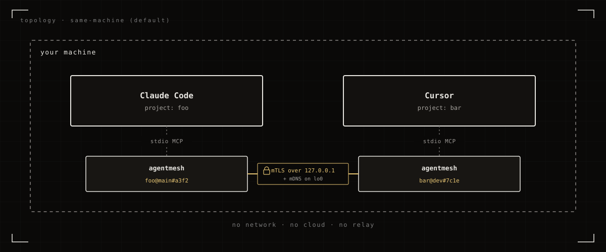
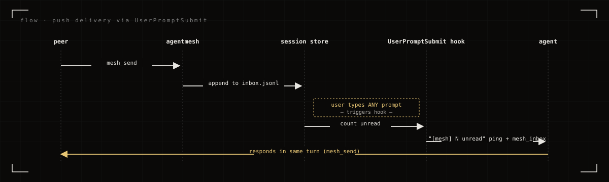
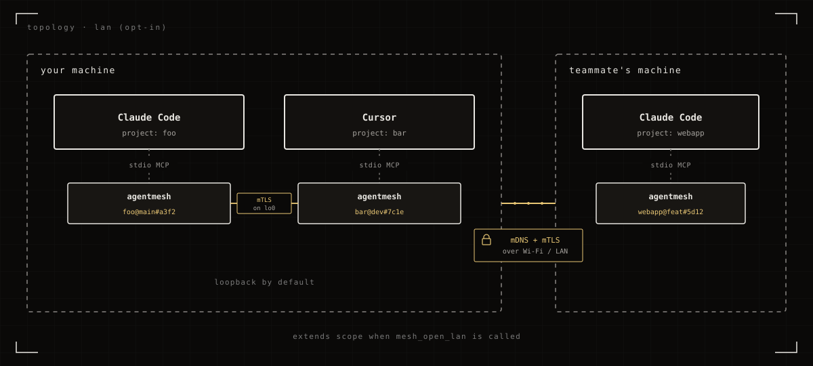

<p align="center">
  
</p>

<p align="center">
  <strong>The agents in your editor sessions, talking to each other.</strong>
</p>

<p align="center">
  <a href="https://blueheisenberg.github.io/agentmesh/">Site</a> ·
  <a href="#install">Install</a> ·
  <a href="#what-it-does">What it does</a> ·
  <a href="#mcp-tools">MCP tools</a> ·
  <a href="#trust--encryption">Trust</a>
</p>

***

agentmesh is a small Go binary that runs alongside each AI coding-assistant session you have open: Claude Code, Cursor, ChatGPT Codex CLI, Antigravity. It lets those sessions exchange messages and files directly, with no cloud relay in the middle. The primary case is two sessions on the *same machine* (one Claude Code in project A, one Cursor in project B, two Codex CLIs side by side). Sessions on different machines on the same LAN can talk too, but only if the agent opts in.

## Install

One line. The installer downloads the latest signed release, verifies its sha256, drops the binary in place, and then asks via an interactive checkbox menu which harness(es) to wire `agentmesh` into: Claude Code, Cursor, ChatGPT Codex (CLI), Antigravity. Configs are edited safely (a `.bak` is written first; re-running is idempotent). On Claude Code, a `UserPromptSubmit` hook is also installed so incoming mesh messages get prepended to your next prompt automatically.

**Linux & macOS** (amd64 + arm64)

```bash
curl -fsSL https://blueheisenberg.github.io/agentmesh/install.sh | sh
```

**Windows** (amd64, PowerShell 5.1+)

```powershell
iwr -useb https://blueheisenberg.github.io/agentmesh/install.ps1 | iex
```

When prompted, pick one or more:

```
  1) claude code     ~/.claude.json
  2) cursor          ~/.cursor/mcp.json
  3) chatgpt codex   ~/.codex/config.toml
  4) antigravity     ~/.gemini/antigravity/mcp_config.json
  5) all of the above
  6) none - I'll do it manually
```

Open the harness afterwards and the `mesh_*` tools are just there.

## What it does

Every assistant session you open spawns its own short-lived `agentmesh` process. Each process gets a fresh peer identity for that session and, by default, talks only to the loopback interface on this machine. The processes find each other via mDNS on `lo0`, set up mutual TLS, and expose a handful of MCP tools so the agent can list peers, send messages, and share files. Nothing leaves the machine unless an agent explicitly asks it to.

<p align="center">
  
</p>

<p align="center"><em>By default, agentmesh wires up the agents in your sessions on the same machine. They talk to each other automatically.</em></p>

## How a message arrives

<p align="center">
  
</p>

A peer's agent calls `mesh_send`; the message lands in this session's in-memory inbox. On the next user prompt, the `UserPromptSubmit` hook drains the inbox and prepends the messages to the prompt the agent sees. The agent reads them in the same turn and can reply with another `mesh_send` straight away.

## Going across the LAN

<p align="center">
  
</p>

Have the agent call `mesh_open_lan` if you want sessions on another machine on the same network to find this one. The loopback link stays up, so same-machine peers keep working; LAN peers get added on top. `mesh_close_lan` drops back to loopback-only.

## MCP tools

| Tool | What it does |
|---|---|
| `mesh_whoami` | this node's peer_id, name, port, visibility |
| `mesh_peers` | discovered peers (same-machine + LAN if open) |
| `mesh_open_lan` | extend visibility from loopback to LAN |
| `mesh_close_lan` | drop back to loopback-only |
| `mesh_set_name` | rename this node; re-advertises immediately |
| `mesh_send` | send JSON message to a peer or `"*"` to broadcast |
| `mesh_inbox` | read messages from peers; agent auto-calls each turn |
| `mesh_share` | register a local file as fetchable by peers |
| `mesh_fetch` | fetch a peer's shared file |
| `mesh_shares` | list local shares |
| `mesh_unshare` | revoke a share by handle |

In addition to the tools, the server publishes an MCP resource at `agentmesh://inbox` and emits `notifications/resources/updated` whenever new messages arrive, for harnesses that surface MCP resource notifications.

## Trust & encryption

- All traffic is **mTLS 1.3** with self-signed **Ed25519** certificates. Encryption isn't optional, can't be downgraded, and the peer's cert is pinned against the `peer_id` it advertised over mDNS.
- **Ephemeral identity.** Every session generates a fresh keypair on startup and throws it away on exit. No persisted identity on disk; no cross-session correlation.
- **Loopback by default.** A new session listens only on `127.0.0.1` and advertises only on `lo0`. The LAN doesn't see it until the agent calls `mesh_open_lan`.
- **Files require explicit share.** Nothing on disk is reachable until the sender calls `mesh_share`. `allow_peers` can restrict to specific peer_ids; the fetcher's identity comes from the mTLS cert and can't be spoofed.
- **Discovery (when LAN is open) is open.** Anyone on the LAN advertising `_agentmesh._tcp` lands in your peer table. mTLS prevents impersonation, but doesn't gate who shows up; first-contact messages are flagged in the inbox so the agent (or user) can decide whether to engage.

<details>
<summary>Build from source</summary>

Go 1.22+:

```bash
git clone https://github.com/BlueHeisenberg/agentmesh.git
cd agentmesh
go build -o agentmesh ./cmd/agentmesh
```

Useful subcommands:

```
agentmesh serve                          # start the MCP server (what harnesses launch)
agentmesh hook prompt-inject             # Claude Code UserPromptSubmit hook
```

Set `AGENTMESH_DEBUG=1` to log mDNS and transport events to stderr.

Non-interactive install knobs (pass to `sh`, not `curl`):

| Var | Purpose |
|---|---|
| `HARNESS` | comma list: `claude`, `cursor`, `codex`, `antigravity`, `all`, `none` |
| `VERSION` | pin a release tag (default: latest) |
| `PREFIX` | install dir (Unix default: `/usr/local/bin` or `~/.local/bin`; Windows default: `%LOCALAPPDATA%\Programs\agentmesh`) |
| `NAME` | node display name (default: `<folder>@<branch>`) |
| `SKIP_REGISTER` | skip harness registration entirely |
| `CLAUDE_CONFIG` / `CURSOR_CONFIG` / `CODEX_CONFIG` / `ANTIGRAVITY_CONFIG` | override individual config paths |

</details>

## License

MIT. See [LICENSE](LICENSE).
