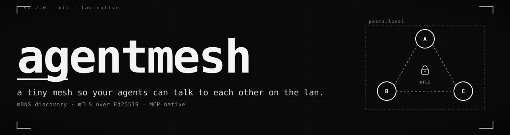

<p align="center">
  
</p>

<p align="center">
  <strong>A tiny mesh so your agents can talk to each other on the LAN.</strong><br>
  <em>mDNS discovery · mTLS over Ed25519 · MCP-native · ~1.5k LOC of Go.</em>
</p>

<p align="center">
  <a href="https://blueheisenberg.github.io/agentmesh/">Site</a> ·
  <a href="#install">Install</a> ·
  <a href="#how-it-works">How it works</a> ·
  <a href="#mcp-tools">MCP tools</a> ·
  <a href="#trust-model">Trust model</a>
</p>

***

## The problem

You're running two harnessed agents — Claude Code on your laptop, Claude Code on a teammate's, maybe one in a VM. Each one has *its* context, *its* files, *its* memory. There is no way for them to **talk to each other**, let alone hand off a file, ask a question, or coordinate without going through the cloud.

The internet is the wrong layer for this. The LAN is right there.

## What this is

`agentmesh` is a small static binary you point your MCP-speaking harness at. It boots, **finds the other nodes on your local network via mDNS**, sets up **mutual TLS** between them using each node's Ed25519 keypair, and exposes a handful of MCP tools so the agent can list peers, exchange messages, and share files — under the user's control.

```
┌──────────────┐  stdio MCP   ┌──────────────────┐    mDNS + mTLS    ┌──────────────────┐  stdio MCP  ┌──────────────┐
│ Claude Code  │ ───────────► │  agentmesh node  │ ◄───────────────► │  agentmesh node  │ ◄────────── │ Claude Code  │
│  (laptop A)  │              │   (laptop A)     │      LAN-only     │   (laptop B)     │             │  (laptop B)  │
└──────────────┘              └──────────────────┘                   └──────────────────┘             └──────────────┘
```

One node per harness instance. The harness never talks to another harness directly — only to its own local node. The nodes do the P2P.

## Install

One line. Both installers download the latest signed release, verify its sha256, drop the binary in place, and then ask you which harness(es) you want `agentmesh` wired into — Claude Code, Cursor, ChatGPT Codex (CLI), and/or Antigravity. The config files are edited safely (a `.bak` is written first; re-running is idempotent).

**Linux & macOS** (amd64 + arm64)

```bash
curl -fsSL https://blueheisenberg.github.io/agentmesh/install.sh | sh
```

**Windows** (amd64, PowerShell 5.1+)

```powershell
iwr -useb https://blueheisenberg.github.io/agentmesh/install.ps1 | iex
```

When prompted, pick one or more:

```
  1) claude code     ~/.claude.json
  2) cursor          ~/.cursor/mcp.json
  3) chatgpt codex   ~/.codex/config.toml
  4) antigravity     ~/.gemini/antigravity/mcp_config.json
  5) all of the above
  6) none — I'll do it manually
```

Open the harness afterwards and the eight `mesh_*` tools are just there.

<details>
<summary>Knobs & non-interactive use</summary>

Pass env vars to **`sh`**, not `curl`:

```bash
curl … | HARNESS=claude,cursor VERSION=v0.2.0 NAME=davids-laptop sh
```

PowerShell variant — set `$env:*` before piping into `iex`:

```powershell
$env:HARNESS='claude,cursor'; iwr -useb https://blueheisenberg.github.io/agentmesh/install.ps1 | iex
```

| Var | Purpose |
|---|---|
| `HARNESS` | comma list — `claude`, `cursor`, `codex`, `antigravity`, `all`, `none` |
| `VERSION` | pin a release tag (default: latest) |
| `PREFIX` | install dir (Unix default: `/usr/local/bin` or `~/.local/bin`; Windows default: `%LOCALAPPDATA%\Programs\agentmesh`) |
| `NAME` | node display name (default: short hostname) |
| `SKIP_REGISTER` | skip harness registration entirely |
| `CLAUDE_CONFIG` / `CURSOR_CONFIG` / `CODEX_CONFIG` / `ANTIGRAVITY_CONFIG` | override individual config paths |

**From source** (Go 1.22+):

```bash
git clone https://github.com/BlueHeisenberg/agentmesh.git
cd agentmesh
go build -o agentmesh ./cmd/agentmesh
```

</details>

## Quick start

Two Claude Code instances on the same network. One sends a greeting; the other replies. From a real end-to-end run with `claude -p`:

```
node-A: mesh_whoami           → peer_id=6c21f0c11fac9b54…
node-A: mesh_peers            → sees node-B
node-A: mesh_send to=node-B, topic="greeting", body={"msg":"hello from A"}

node-B: mesh_inbox wait=20s   → message from node-A
node-B: mesh_send back        → topic="reply", body={"msg":"ack from B"}
```

The whole round trip — discovery, TLS handshake, MCP tool calls on both sides, agents reading and writing the inbox — took **about one second**.

## How it works

Every node is the same thing, doing four jobs:

1. **Identity.** On first run, generates an **Ed25519 keypair** and persists it to `~/.agentmesh/identity.json`. The public key (hex) is the `peer_id`. The same keypair becomes a self-signed X.509 certificate used by TLS — *no separate CA, no cert renewal*.
2. **Discovery.** Advertises itself as `_agentmesh._tcp.local` over mDNS, with the peer_id embedded in the TXT record. Browses for the same service type. Peers come and go automatically.
3. **Transport.** HTTPS server on a random LAN port. Every connection is **mTLS** — the client must present a self-signed Ed25519 cert; the server must present one whose pubkey matches the `peer_id` the client expected from mDNS. A LAN attacker can advertise an arbitrary `peer_id`, but they can't talk to you *as* that peer without the matching private key.
4. **MCP shim.** Each tool is a thin wrapper over the node — `mesh_send` POSTs to the peer's `/v1/msg`, `mesh_fetch` does a GET against `/v1/share/{handle}`, and so on.

## MCP tools

| Tool | Purpose |
|---|---|
| `mesh_whoami` | Returns this node's `peer_id`, name, port. |
| `mesh_peers` | Lists peers discovered on the LAN. |
| `mesh_send` | Send a JSON message to a peer, or `"*"` to broadcast. Fire-and-forget. |
| `mesh_inbox` | Read incoming messages. `wait_seconds>0` long-polls. |
| `mesh_share` | Register a file as shareable. Returns a handle. `allow_peers` and `ttl_seconds` are optional. |
| `mesh_fetch` | Fetch a shared blob from a peer. Inline for small blobs; `save_to` for binary or large. |
| `mesh_shares` | List your current shares. |
| `mesh_unshare` | Revoke a share by handle. |

## Trust model

`agentmesh` assumes a **trusted LAN** — home, office, the Wi-Fi at a coworking space you know. Within that perimeter:

- **All traffic is encrypted.** TLS 1.3, mutual auth, Ed25519-backed self-signed certs. The encryption isn't optional, can't be downgraded, and the cert pinning happens against the `peer_id` your peer advertised over mDNS.
- **Identity is the public key.** The `peer_id` *is* the Ed25519 pubkey, hex-encoded. Every authenticated request's "from" is the validated cert pubkey — body-claimed fields like `from_peer_id` are checked against it. You cannot impersonate a peer without their private key.
- **Discovery is open.** Anyone on the LAN advertising `_agentmesh._tcp` lands in your peer table. mTLS prevents anyone from talking to you *as* a known peer, but it doesn't gate who can show up. Messages from never-before-seen peers are flagged with `first_contact: true` in the inbox — the agent (or user) decides whether to engage.
- **Files require explicit share.** Nothing on disk is reachable until the sender calls `mesh_share`. `allow_peers` restricts to specific peer ids, and because the fetcher's identity comes from the mTLS cert, those restrictions can't be spoofed.

For coffee-shop networks or shared corporate Wi-Fi, layer in a room code (shared secret) or a pubkey allowlist on top.

## Wire protocol

Three HTTPS endpoints, JSON bodies, TLS 1.3 mutual auth, no other protocol layers:

| Method | Path | Body | Returns |
|---|---|---|---|
| `GET` | `/v1/hello` | — | `{peer_id, name, version}` |
| `POST` | `/v1/msg` | `{from_peer_id, from_name, topic, body}` | `{ok: true}` |
| `GET` | `/v1/share/{handle}` | — | blob bytes; caller identity = client cert pubkey |

That's it. The whole thing is **~1500 LOC of Go** across six packages.

## Layout

```
cmd/agentmesh/         entry point + e2e test
internal/identity/     Ed25519 keypair + self-signed TLS cert
internal/discovery/    mDNS advertise/browse + peer registry
internal/transport/    HTTPS server + pinned client (mTLS)
internal/inbox/        in-memory queue with blocking Wait
internal/shares/       handle-based registry with allowlist + expiry
internal/mcp/          eight MCP tools over mark3labs/mcp-go
```

Run `AGENTMESH_DEBUG=1` to log mDNS events to stderr.

## What's intentionally out of scope

- **No NAT traversal.** This is a LAN tool. If you need agents across the open internet, you want a relay, not a mesh.
- **No persistence.** The inbox lives in memory. If the node dies, the queue dies with it. The agent already has its own conversation history.
- **No file streaming or chunking primitives.** A "file" is a single HTTPS GET. Want resumable transfer? Layer it on `mesh_share` + your own protocol — the wire protocol is small on purpose.

## License

MIT. See [LICENSE](LICENSE).
